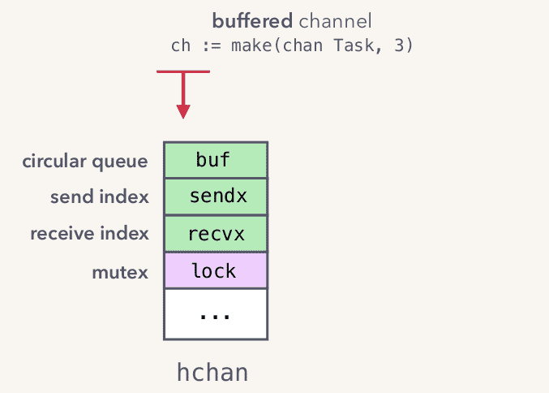
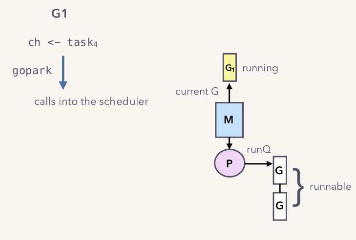

## 深入浅出 Channel 实现机制
### 使用样例
话不多说，先上一段生产者消费者代码来认识下 channel 的使用方式:
```Go
func main() {
	taskQueue := make(chan interface{}, 5)
	// start worker
	for i := 0; i < 5; i++ {
		go worker(taskQueue)
	}
	// send task to task queue
	for i := 0; i < 100; i++ {
		taskQueue <- i
	}
}

func worker(taskQueue <-chan interface{}) {
	for {
		// Receive task
		task := <-taskQueue
		process(task)
	}
}

func process(task interface{}) {
	// do something
}
```
以上代码即实现线程安全的生产与消费:
1. `main()` 函数中 `taskQueue := make(chan interface{}, 5)` 代码行，初始化长度为 5 的工作队列;
2. `go worker(taskQueue)` 表示启动工作协程(非操作系统线程)，4~6 行初始化完成五个消费者协程;
3. `taskQueue <- i` 表示生产一个任务，8~10 行完成 100 个任务的生产工作；
4. ` worker(taskQueue <-chan interface{})` 函数实现消费者协程的工作内容，持续接收所有任务，每当任务派发到队列中，消费者协程通过 `<-taskQueue` 接收任务并通过 ` process(task interface{})`函数完成消费动作；

### 特性

通过以上代码我们可以了解到 Channel 的一些特性：
1. 它是线程安全的；
2. 它在协程之间传递消息；
3. 它是 FIFO 的数据结构；
4. 会引起协程阻塞和解除阻塞；

现在我们了解到 Channel 正确使用方式和特性，接下来让我们来撕开伪装揭露真相。

##### 1. 创建 Channel（hchan 数据结构）

首先，你需要使用 `make(chan interface{}, 5)` 内置函数来创建一个缓存容量为 5 的 Channel,当然你也可以使用 ` 或 make(chan interface{})`创建一个不带缓存的。接下来我们主要讨论带缓存的 Channel，下面是我们创建的 Channel 内存结构：
我们在堆内存中创建就 hchan 数据结构，并返回指针。因此我们才可以通过 `taskQueue <- i` 和 `task := <-taskQueue` 使用它。接下来我们看看我们创建的数据结构和创建方式：
```Go
// 实现 Channel 的数据结构hchan
// src/runtime/chan.go
type hchan struct {
	qcount   uint           // 队列总数据长度
	dataqsiz uint           // 队列当前容量
	buf      unsafe.Pointer // 缓冲区数据结构，使用环形数组实现
	elemsize uint16         // 单个元素的大小
	closed   uint32         // 是否关闭的标志位
	elemtype *_type         // 元素类型
	sendx    uint           // 发送数据下标
	recvx    uint           // 接收数据下标
	recvq    waitq          // 因接收数据等待队列
	sendq    waitq          // 因发送数据等待队列

	lock mutex              // 并发锁,保护 hchan 所有字段线程安全
}

// Groutine 等待列表,sudog struct是对等待中的 Groutine 封装数据结构
// src/runtime/chan.go
type waitq struct {
	first *sudog
	last  *sudog
}

func makechan(t *chantype, size int) *hchan {
	var c *hchan
	switch {
	case mem == 0:
		// 不含缓冲或者队列中缓冲数据为 0
		c = (*hchan)(mallocgc(hchanSize, nil, true))
		c.buf = c.raceaddr()
	case elem.ptrdata == 0:
		// 不包含缓冲
		// 为 hchan 数据结构申请连续内存
		c = (*hchan)(mallocgc(hchanSize+mem, nil, true))
		c.buf = add(unsafe.Pointer(c), hchanSize)
	default:
		// 有缓冲 channel 初始化
		c = new(hchan)
		// 堆上分配 buf 内存
		c.buf = mallocgc(mem, elem, true)
	}
	c.elemsize = uint16(elem.size)
	c.elemtype = elem
	c.dataqsiz = uint(size)
	lockInit(&c.lock, lockRankHchan)

	return c
}
```
当执行 `taskQueue := make(chan interface{}, 5)`代码后，Go运行时则会执行 `makechan(interfacetype, 5)` 函数创建一个 hchan数据结构，值得注意的是当 Channel 不含缓冲时，hchan 是连续内存空间。

##### 2. Channel 的发送和接收（hchan 数据结构）
`main()`自身就是一个生产者协程，通过 10~12 行代码生产任务并放入队列 `taskQueue` 中，我们通过 `go worker(taskQueue)`启动的 5
个消费消费者来完成消费任务，整个生产和消费过程都是线程安全的，不会存在数据紊乱问题。当`taskQueue`满载时，生产者协程会被挂起；
同理，消费者线程也会被挂起.这一行为是由 Go 的 运行时调度器完成的，协程也是属于用户态的实现，被 Go
的运行时调度器管理，和操作系统的线程相比它更加的轻量化，因此并发度也能进一步提高。Go
的调度器专门用于调度协程和操作系统线程的线程，比例为（1：N），即一个线程对应多个协程，调度器管理的线程数量取决于用户分配的数量，默认等于CPU核心数。下面是GMP模型的图示:
当 Channel 的数据满载时，生产者协程因为无法继续生产资源而被挂起，Channel 将会通知调度器挂起某个协程，此时调度器会将这个协程移出`runQ`队列，并改变其状态为等待中.
通过这种方式调度器已经完成上下文的切换，而不需要挂起操作系统线程，成本非常低。当消费者协程完成消费后，Channel 不在数据满载，此时会通知调度器，将此前等待的生产者协程重新置为可运行状态，并加入`runQ`队列等待运行。接下来我们看看`taskQueue <- i`代码的实现逻辑：
```Go
func chansend(c *hchan, ep unsafe.Pointer, block bool, callerpc uintptr) bool {
	// 如果当前 Channel是关闭状态或当前缓冲器满载则无法发送数据到Channel
	if !block && c.closed == 0 && full(c) {
		return false
	}
	// 锁定当前 Channel
	lock(&c.lock)
	// 如果当前 Channel 已被关闭，则释放锁，并执行 panic 异常
	if c.closed != 0 {
		unlock(&c.lock)
		panic(plainError("send on closed channel"))
	}
	// 尝试获取因接收而等待的 Groutine，则直接将数据发送给它,并解当前 Channel
	if sg := c.recvq.dequeue(); sg != nil {
		send(c, sg, ep, func() { unlock(&c.lock) }, 3)
		return true
	}
	// 如果当前缓存队列未满，则将该数据加入缓存队列
	if c.qcount < c.dataqsiz {
		// Space is available in the channel buffer. Enqueue the element to send.
		qp := chanbuf(c, c.sendx)
		if raceenabled {
			raceacquire(qp)
			racerelease(qp)
		}
		typedmemmove(c.elemtype, qp, ep)
		c.sendx++
		if c.sendx == c.dataqsiz {
			c.sendx = 0
		}
		c.qcount++
		unlock(&c.lock)
		return true
	}

	// 当前发送数据无法被正确接收，则获取当前 Groutine，并加入因发送而等待的队列
	gp := getg()
	mysg := acquireSudog()
	mysg.releasetime = 0
	mysg.elem = ep
	mysg.waitlink = nil
	mysg.g = gp
	mysg.isSelect = false
	mysg.c = c
	gp.waiting = mysg
	gp.param = nil
	c.sendq.enqueue(mysg)
```
下面是`task := <-taskQueue`的实现方式：
```Go
func chanrecv(c *hchan, ep unsafe.Pointer, block bool) (selected, received bool) {

	// 如果当前 Channel 未被锁定，且缓存队列为空，则返回空值
	if !block && empty(c) {
		if atomic.Load(&c.closed) == 0 {
			// Because a channel cannot be reopened, the later observation of the channel
			// being not closed implies that it was also not closed at the moment of the
			// first observation. We behave as if we observed the channel at that moment
			// and report that the receive cannot proceed.
			return
		}
		if empty(c) {
			if raceenabled {
				raceacquire(c.raceaddr())
			}
			if ep != nil {
				typedmemclr(c.elemtype, ep)
			}
			return true, false
		}
	}
	//锁定当前 Channel
	lock(&c.lock)
	// 缓存队列为空则返回空值
	if c.closed != 0 && c.qcount == 0 {
		if raceenabled {
			raceacquire(c.raceaddr())
		}
		unlock(&c.lock)
		if ep != nil {
			typedmemclr(c.elemtype, ep)
		}
		return true, false
	}
	// 从因接收发送而等待的队列中获取原生，并解锁 Channel
	if sg := c.sendq.dequeue(); sg != nil {
		recv(c, sg, ep, func() { unlock(&c.lock) }, 3)
		return true, true
	}
	// 如果当前 队列元素不为 0
	if c.qcount > 0 {
		// 从缓存中获取元素
		qp := chanbuf(c, c.recvx)
		if raceenabled {
			raceacquire(qp)
			racerelease(qp)
		}
		if ep != nil {
			typedmemmove(c.elemtype, ep, qp)
		}
		typedmemclr(c.elemtype, qp)
		c.recvx++
		if c.recvx == c.dataqsiz {
			c.recvx = 0
		}
		c.qcount--
		unlock(&c.lock)
		return true, true
	}
	// 因接收数据而等待，将当前 Groutine加入等待队列
	gp := getg()
	mysg := acquireSudog()
	mysg.releasetime = 0
	mysg.elem = ep
	mysg.waitlink = nil
	gp.waiting = mysg
	mysg.g = gp
	mysg.isSelect = false
	mysg.c = c
	gp.param = nil
	c.recvq.enqueue(mysg)
	success := mysg.success
	gp.param = nil
	mysg.c = nil
	releaseSudog(mysg)
	return true, success
}

```

##### 3. 为什么要这样实现？
Go语言设计者主要考虑两点：
1. 简单性：带锁队列优先于无锁实现。
2. 性能：goroutine唤醒路径是无锁的，并且可能更少的内存副本。
在通道的实现中，在简单性和性能之间有一个精明的权衡。

### 附录
##### 参考链接
1. https://about.sourcegraph.com/go/understanding-channels-kavya-joshi/
2. https://zhuanlan.zhihu.com/p/27917262

##### 待办事项
1. 需要收集golang 官网设计文档和 Blog

