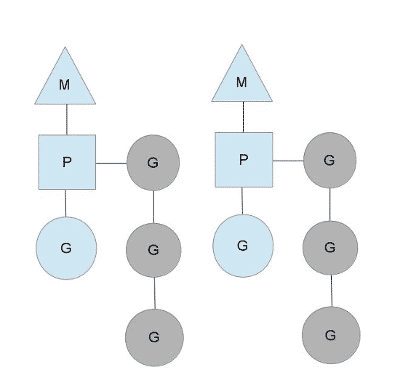

## 深入理解 Goroutine 原理
Go语言最大的特色就是从语言层面支持并发（Goroutine），Goroutine是Go中最基本的执行单元。
事实上每一个 Go 程序至少有一个 Goroutine：主Goroutine。当程序启动时，它会自动创建。

### 知识准备

进程(Process): 进程是一个具有一定独立功能的程序在一个数据集上的一次动态执行的过程，是操作系统进行资源分配和调度的一个独立单位，是应用程序运行的载体。进程是一种抽象的概念，从来没有统一的标准定义。

线程(Thread)：线程是程序执行中一个单一的顺序控制流程，是程序执行流的最小单元，是处理器调度和分派的基本单位。一个进程可以有一个或多个线程，各个线程之间共享程序的内存空间(也就是所在进程的内存空间)。

协程(Coroutine)：是一种基于线程之上，但又比线程更加轻量级的存在，这种由程序员自己写程序来管理的轻量级线程叫做『用户空间线程』，具有对内核来说不可见的特性。

### 使用样例
```Go
func main() {
	taskQueue := make(chan interface{}, 5)
	// start worker
	for i := 0; i < 5; i++ {
		go worker(taskQueue)
	}
	// send task to task queue
	for i := 0; i < 100; i++ {
		taskQueue <- i
	}
}

func worker(taskQueue <-chan interface{}) {
	for {
		// Receive task
		task := <-taskQueue
		process(task)
	}
}

func process(task interface{}) {
	// do something
}
```

以上代码即实现线程安全的生产与消费：
1. `main()` 函数中 `taskQueue := make(chan interface{}, 5)` 代码行，初始化长度为 5 的工作队列;
2. `go worker(taskQueue)` 表示启动工作协程(非操作系统线程)，4~6 行初始化完成五个消费者协程;
3. `taskQueue <- i` 表示生产一个任务，8~10 行完成 100 个任务的生产工作；
4. ` worker(taskQueue <-chan interface{})` 函数实现消费者协程的工作内容，持续接收所有任务，每当任务派发到队列中，消费者协程通过 `<-taskQueue` 接收任务并通过 ` process(task interface{})`函数完成消费动作；

我们可以通过 `go worker(taskQueue)` 发现，创建一个 Goroutine 是如此简单，直接使用 `go` 关键字加方法即可。

### 实现原理
下面我们来尝试理解背后的实现原理。
##### Goroutine 实现模型 G-M-P

`M`代表着真正的执行计算资源。在绑定有效的p后，进入schedule循环；而schedule循环的机制大致是从各种队列、p的本地队列中获取G，切换到G的执行栈上并执行G的函数，调用goexit做清理工作并回到m，如此反复。M并不保留G状态，这是G可以跨M调度的基础。

`P`表示逻辑processor，P的数量决定了系统内最大可并行的G的数量（前提：系统的物理cpu核数>=P的数量）；P的最大作用还是其拥有的各种G对象队列、链表、一些cache和状态。

`G`表示 goroutine，存储了goroutine的执行stack信息、goroutine状态以及goroutine的任务函数等；另外G对象是可以重用的。

`P` 的数量由环境变量中的GOMAXPROCS决定，默认和 CPU 核心数对应，例如在 4Core的服务器上回启动4个线程。G:P为M:N(M>>N)，每个P会将Goroutine从一个就绪的队列中做Pop操作，为了减小锁的竞争，通常情况下每个P会负责一个队列。
如下图所示:
### 源码解读


### 优势

1. 开销小: 线程在得到了很多与进程相同的控制权的同时，开销非常的大，在 Goroutine 中则不需这些额外的开销，
每个 goroutine 默认占用内存远比 Java 、C 的线程少（goroutine：4KB ，线程：8MB），这也是 Golang 的程序可以支持 10w 级别的 缘由。

2. 调度性能好: 在 Golang 的程序中，操作系统级别的线程调度，通常不会做出合适的调度决策。例如在GC时，内存必须要达到一个一致的状态。在Goroutine机制里，Go 运行时可自我控制Goroutine的调度，在一个合适的时间进行GC。
在应用层模拟的线程，避免操作系统级的上下文切换的额外耗费，兼顾了多线程的优点，简化高并发程序的复杂度。

### 附录
##### 参考链接
1. https://zhuanlan.zhihu.com/p/95056679
2. https://tonybai.com/2017/06/23/an-intro-about-goroutine-scheduler/

##### 待办事项
1. 需要收集golang 官网设计文档和 Blog