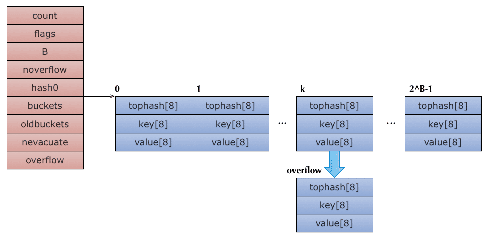

## 深入理解 `map` 的实现机制

`map` 是一个由数组+链表实现的HashTable，非常基础的数据结构，可以说是每一门高级语言必备，如 `Java` 中的 `HashMap`，`Python` 中的 `dict` 都是类似的使用方式和特性。

### 使用样例
```Go
func main() {
    countryCapitalMap := make(map[string]string,1)

    countryCapitalMap [ "France" ] = "巴黎"

    for country := range countryCapitalMap {
        fmt.Println(country, "首都是", countryCapitalMap [country])
    }
    capital := countryCapitalMap [ "American" ] 
    fmt.Println("American 的首都是", capital)
```
### 实现原理

下面我们来尝试理解背后的实现原理。

##### 结构定义
```Go
type hmap struct {
	count     int       // 元素的个数
	flags     uint8     // 状态标志
	B         uint8     // 可以最大存储 6.5 *2^B 个数
	noverflow uint16    // 溢出桶的个数
	hash0     uint32    // hash 种子

	buckets    unsafe.Pointer // 当前存储桶地址，每次两倍扩容的；如果 count==0 ,可能为 nil
	oldbuckets unsafe.Pointer // 扩容前的存储桶地址
	nevacuate  uintptr        // 记录搬迁进度，小于 nevacuate 则已经搬迁

	extra *mapextra // optional fields
}

type mapextra struct {
	overflow    *[]*bmap //overflow 指向一个slice，slice的元素是桶(bmap)的地址，这些桶都是当前溢出桶，overflow存在的意义在于防止溢出桶被gc。；
	oldoverflow *[]*bmap // Go map在hash冲突过多时，会发生扩容操作，为了不全量搬迁数据，使用了增量搬迁扩容，保存了旧的溢出桶集合
	nextOverflow *bmap 	// 指向自由溢出 bucket 的指针
}

type bmap struct {
    // 每个元素hash值的高8位，如果tophash[0] < minTopHash，表示这个桶的搬迁状态
    tophash [bucketCnt]uint8
    // 接下来是8个key、8个value，但是我们不能直接看到；为了优化对齐，go采用了key放在一起，value放在一起的存储方式，
    // 再接下来是hash冲突发生时，下一个溢出桶的地址
}

```
可以看出我们的map是基于hashTable 的实现方式，有了以上的结构定义，下面我们看看特定 key 的计算方式：
|  key   | hash(alg.hash(key, uintptr(h.hash0)))  | hashtop(uint8(hash >> (sys.PtrSize*8 - 8))) | bucketIndex(hash & (uintptr(1)<<h.B - 1)) |
|  ----  | ----  | ----  | ----  |
|  key   | alg.hash(key, uintptr(h.hash0))  | uint8(hash >> (sys.PtrSize*8 - 8)) | hash & (uintptr(1)<<h.B - 1) |
此时对于的内存结构图:

##### 创建 map

当我们执行 `countryCapitalMap := make(map[string]string,1)` 代码，则执行如下代码完成 map 的创建。
```Go

func makemap(t *maptype, hint int, h *hmap) *hmap {
	mem, overflow := math.MulUintptr(uintptr(hint), t.bucket.size)
	if overflow || mem > maxAlloc {
		hint = 0
	}

	// 初始化 hmap
	if h == nil {
		h = new(hmap)
	}
	h.hash0 = fastrand()

	// 如果当前容量超过装载因子阈值，则扩容
	B := uint8(0)
	for overLoadFactor(hint, B) {
		B++
	}
	h.B = B

	// 初始化 hashTable ，如果 B!=0 则完成存储桶的初始化；
    // 否则在第一次使用时初始化；
	if h.B != 0 {
		var nextOverflow *bmap
		h.buckets, nextOverflow = makeBucketArray(t, h.B, nil)
		if nextOverflow != nil {
			h.extra = new(mapextra)
			h.extra.nextOverflow = nextOverflow
		}
	}

	return h
}
```

##### 访问 map

当我们执行`capital := countryCapitalMap [ "American" ] ` 时，我们将通过如下方法查找对应的 value.
值得注意的是，不会反悔nil指针，只会返回空对象，我们可以通过ok参数校验是否获取成功。

```Go
func mapaccess1(t *maptype, h *hmap, key unsafe.Pointer) unsafe.Pointer {
	hash := t.hasher(key, uintptr(h.hash0))     // 计算hash值
	m := bucketMask(h.B)    // 计算桶索引
	b := (*bmap)(add(h.buckets, (hash&m)*uintptr(t.bucketsize)))

	if c := h.oldbuckets; c != nil {
		if !h.sameSizeGrow() {
			// 当前扩容操作未完成，遮住新扩容的索引
			m >>= 1
		}
		oldb := (*bmap)(add(c, (hash&m)*uintptr(t.bucketsize)))
		if !evacuated(oldb) {
			b = oldb
		}
	}
	top := tophash(hash)
bucketloop:
	for ; b != nil; b = b.overflow(t) {
        // 遍历存储桶，寻找到 tophash相等的桶
		for i := uintptr(0); i < bucketCnt; i++ {
			if b.tophash[i] != top {
				if b.tophash[i] == emptyRest {
					break bucketloop
				}
				continue
			}
            // hash满足条件，获取key的值
			k := add(unsafe.Pointer(b), dataOffset+i*uintptr(t.keysize))
			if t.indirectkey() {
				k = *((*unsafe.Pointer)(k))
			}
            // 如果key 相等则范围当前元素
			if t.key.equal(key, k) {
				e := add(unsafe.Pointer(b), dataOffset+bucketCnt*uintptr(t.keysize)+i*uintptr(t.elemsize))
				if t.indirectelem() {
					e = *((*unsafe.Pointer)(e))
				}
				return e
			}
		}
	}
	return unsafe.Pointer(&zeroVal[0])
}
```
 
 
##### 存入一个kv到 map
为一个 key 分配空间的逻辑;增加写保护和扩容的操作；分配过程和删除过程都没有在oldbuckets中查找，这是因为首先要进行扩容判断和操作.
```Go
func mapassign(t *maptype, h *hmap, key unsafe.Pointer) unsafe.Pointer {
	if h.flags&hashWriting != 0 {  //并发写异常
		throw("concurrent map writes")
	}
	hash := t.hasher(key, uintptr(h.hash0))   // 计算 hash值
	h.flags ^= hashWriting // 锁定map

again:
    // 计算tophash分配存储桶
	bucket := hash & bucketMask(h.B)
	if h.growing() {
		growWork(t, h, bucket)
	}
	b := (*bmap)(unsafe.Pointer(uintptr(h.buckets) + bucket*uintptr(t.bucketsize)))
	top := tophash(hash)

	var inserti *uint8
	var insertk unsafe.Pointer
	var elem unsafe.Pointer
bucketloop:
	for {
        //遍历存储桶
		for i := uintptr(0); i < bucketCnt; i++ {
			if b.tophash[i] != top {
				if isEmpty(b.tophash[i]) && inserti == nil {
					inserti = &b.tophash[i]
					insertk = add(unsafe.Pointer(b), dataOffset+i*uintptr(t.keysize))
					elem = add(unsafe.Pointer(b), dataOffset+bucketCnt*uintptr(t.keysize)+i*uintptr(t.elemsize))
				}
				if b.tophash[i] == emptyRest {
					break bucketloop
				}
				continue
			}
			k := add(unsafe.Pointer(b), dataOffset+i*uintptr(t.keysize))
			if t.indirectkey() {
				k = *((*unsafe.Pointer)(k))
			}
			if !t.key.equal(key, k) {             // 如果 当前元素 key不相等则继续遍历
				continue
			}
			if t.needkeyupdate() {  // 相同的key已存在，则更新它
				typedmemmove(t.key, k, key)
			}
			elem = add(unsafe.Pointer(b), dataOffset+bucketCnt*uintptr(t.keysize)+i*uintptr(t.elemsize))
            //  跳转到收尾处理
			goto done
		}
	}
        
	// 新增当前元素到该桶中
	if t.indirectkey() {
		kmem := newobject(t.key)
		*(*unsafe.Pointer)(insertk) = kmem
		insertk = kmem
	}
	if t.indirectelem() {
		vmem := newobject(t.elem)
		*(*unsafe.Pointer)(elem) = vmem
	}
	typedmemmove(t.key, insertk, key)
	*inserti = top
	h.count++
done:
	h.flags &^= hashWriting  // 接触并发写
	if t.indirectelem() {
		elem = *((*unsafe.Pointer)(elem))
	}
	return elem
}
```
##### 从 map 删除一个元素
TODO
```Go
func mapdelete(t *maptype, h *hmap, key unsafe.Pointer) {
	if raceenabled && h != nil {
		callerpc := getcallerpc()
		pc := funcPC(mapdelete)
		racewritepc(unsafe.Pointer(h), callerpc, pc)
		raceReadObjectPC(t.key, key, callerpc, pc)
	}
	if msanenabled && h != nil {
		msanread(key, t.key.size)
	}
	if h == nil || h.count == 0 {
		if t.hashMightPanic() {
			t.hasher(key, 0) // see issue 23734
		}
		return
	}
	if h.flags&hashWriting != 0 {
		throw("concurrent map writes")
	}

	hash := t.hasher(key, uintptr(h.hash0))

	// Set hashWriting after calling t.hasher, since t.hasher may panic,
	// in which case we have not actually done a write (delete).
	h.flags ^= hashWriting

	bucket := hash & bucketMask(h.B)
	if h.growing() {
		growWork(t, h, bucket)
	}
	b := (*bmap)(add(h.buckets, bucket*uintptr(t.bucketsize)))
	bOrig := b
	top := tophash(hash)
search:
	for ; b != nil; b = b.overflow(t) {
		for i := uintptr(0); i < bucketCnt; i++ {
			if b.tophash[i] != top {
				if b.tophash[i] == emptyRest {
					break search
				}
				continue
			}
			k := add(unsafe.Pointer(b), dataOffset+i*uintptr(t.keysize))
			k2 := k
			if t.indirectkey() {
				k2 = *((*unsafe.Pointer)(k2))
			}
			if !t.key.equal(key, k2) {
				continue
			}
			// Only clear key if there are pointers in it.
			if t.indirectkey() {
				*(*unsafe.Pointer)(k) = nil
			} else if t.key.ptrdata != 0 {
				memclrHasPointers(k, t.key.size)
			}
			e := add(unsafe.Pointer(b), dataOffset+bucketCnt*uintptr(t.keysize)+i*uintptr(t.elemsize))
			if t.indirectelem() {
				*(*unsafe.Pointer)(e) = nil
			} else if t.elem.ptrdata != 0 {
				memclrHasPointers(e, t.elem.size)
			} else {
				memclrNoHeapPointers(e, t.elem.size)
			}
			b.tophash[i] = emptyOne
			// If the bucket now ends in a bunch of emptyOne states,
			// change those to emptyRest states.
			// It would be nice to make this a separate function, but
			// for loops are not currently inlineable.
			if i == bucketCnt-1 {
				if b.overflow(t) != nil && b.overflow(t).tophash[0] != emptyRest {
					goto notLast
				}
			} else {
				if b.tophash[i+1] != emptyRest {
					goto notLast
				}
			}
			for {
				b.tophash[i] = emptyRest
				if i == 0 {
					if b == bOrig {
						break // beginning of initial bucket, we're done.
					}
					// Find previous bucket, continue at its last entry.
					c := b
					for b = bOrig; b.overflow(t) != c; b = b.overflow(t) {
					}
					i = bucketCnt - 1
				} else {
					i--
				}
				if b.tophash[i] != emptyOne {
					break
				}
			}
		notLast:
			h.count--
			break search
		}
	}

	if h.flags&hashWriting == 0 {
		throw("concurrent map writes")
	}
	h.flags &^= hashWriting
}
```
##### 扩容map的存储桶
TODO
```Go

func growWork(t *maptype, h *hmap, bucket uintptr) {
	// make sure we evacuate the oldbucket corresponding
	// to the bucket we're about to use
	evacuate(t, h, bucket&h.oldbucketmask())

	// evacuate one more oldbucket to make progress on growing
	if h.growing() {
		evacuate(t, h, h.nevacuate)
	}
}
```
### 总结
TODO
### 附录
##### 参考链接
1. https://www.jianshu.com/p/aa0d4808cbb8

##### 待办事项
1. 需要收集golang 官网设计文档和 Blog